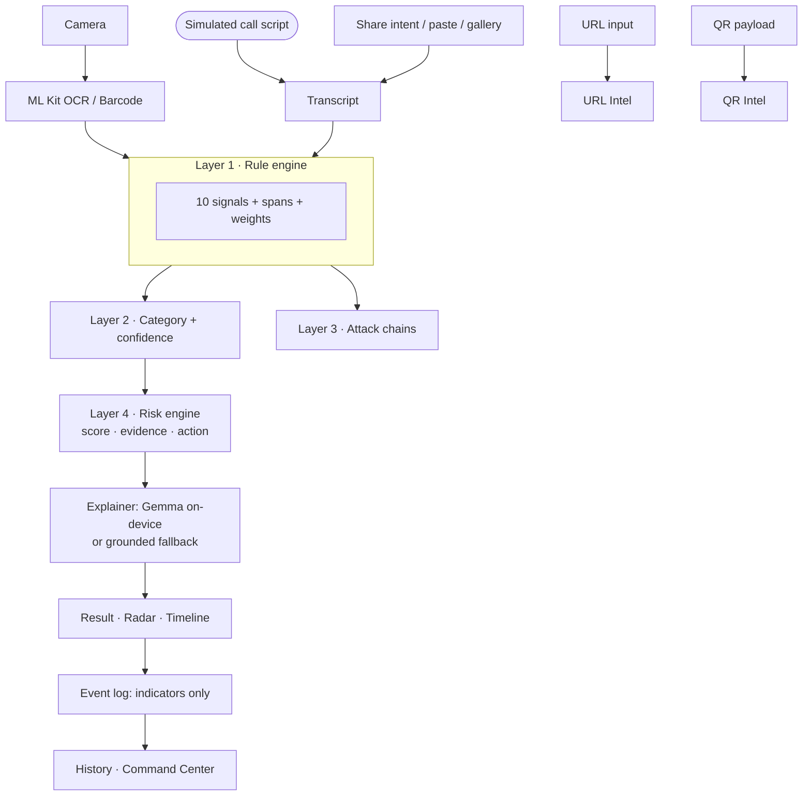

# ScamShield — Real-Time AI Fraud Firewall

> Your phone's real-time AI fraud firewall. Detects suspicious behavior across
> messages, URLs, QR codes, photos and simulated voice calls, shows the
> evidence, and recommends the safest next action. **On-device first —
> airplane-mode ready.**

## Problem

India loses thousands of crores yearly to KYC/OTP phishing, lottery lures,
fake-courier fees, task-job fraud and "digital arrest" extortion. Victims are
often non-technical family members who get a scary message — and obey it.
Cloud blocklists answer too late, explain nothing, and upload your SMS to do it.

## Solution

Detect → Understand → Explain → Intervene → Protect, all on the phone:

- **Rules own the verdict** (10 deterministic signals, exact highlighted spans)
- **On-device Gemma explains** in plain language — or a grounded built-in
  fallback when the model file isn't bundled
- **Evidence-first UI**: weighted `WHY WE FLAGGED THIS`, calibrated confidence,
  category, and Verify/Block/Report actions on every result

## Key Features

| Feature | What it does | Offline? |
|---|---|---|
| Message scan | Paste / share SMS & WhatsApp text → verdict + highlights | ✅ |
| ScamLens QR | Camera QR → UPI-payment vs link classification + warning | ✅ (ML Kit) |
| ScamLens URL | Host/TLD/punycode/IP/shortener/brand analysis, never fetched | ✅ |
| ScamLens Photo | Camera/gallery → offline OCR → full scan | ✅ |
| Scam Radar | Simulated scam-call transcript streams in, risk updates live | ✅ (scripted) |
| Attack timeline | KYC bait → link → harvest → OTP → fee, per-stage evidence | ✅ |
| Evidence-first AI | +weight per signal, "ScamShield risk score (heuristic)" | ✅ |
| Family Mode | Giant STOP card, do/don't list, trusted contact | ✅ |
| Scam History | Indicators only, redacted previews, deletable | ✅ local |
| Privacy Center | Processing table, clear-data buttons, cloud: not configured | ✅ |
| Command Center | Live feed, analytics (this device), clipboard JSON sync | ✅ |
| Judge Mode | Architecture, model status, latency, signal catalog | ✅ |
| Demo Mode | 6 scenarios + bonus chain, staged reveal | ✅ |
| Dark mode | System-friendly light/dark themes | ✅ |

## Architecture



**AI/ML actually used:** MediaPipe LLM Inference (`flutter_gemma`, Gemma 3 1B)
for explanations; ML Kit on-device text recognition + barcode scanning.
No training, no servers, no API keys.

## Phone Integration

- Share sheet: SMS/WhatsApp text **and** screenshots flow straight into analysis
- Camera (QR), gallery/camera photos (OCR), haptics scaled to risk level
- Bottom-nav mobile layout, large risk indicators (icon + text + color, never
  color alone), dark mode

## Office Kit Integration

Command Center (in-app, opens on desktop builds too) reads the same local
event log: live feed with HIGH/MEDIUM/LOW filters, this-device analytics,
and **phone↔desktop sync via clipboard JSON** — Export on the phone, Import
on desktop. No servers, no accounts. Raw message content never syncs (only
indicators + redacted previews).

## Demo (judge path, ~3 min, airplane mode ON)

1. Home → "Your AI fraud firewall", 🔒 Offline badge
2. Demo Mode → Run **Fake KYC** → staged HIGH RISK reveal
3. **WHY WE FLAGGED THIS**: +weights, highlighted spans
4. Lens → QR tab → scan a UPI QR → "POTENTIAL PAYMENT SCAM"
5. Radar → Play simulated digital-arrest call → watch risk climb
6. Demo Mode → Run **KYC attack chain** → 5-stage timeline
7. Command Center → event arrived live → analytics
8. Privacy Center → what is/isn't stored → Clear history
9. Demo Mode → Run **Genuine alert** → green restraint moment

## Installation

```powershell
# 1. Flutter stable + Android SDK 34+, JDK 17+
# 2. Get packages
flutter pub get
# 3. (Optional) on-device explanations: copy gemma-3-1b-it.task
#    into assets/models/  (gitignored, never downloaded at runtime)
# 4. Run / test / build
flutter run
flutter test
flutter build apk --debug
# app-debug.apk -> build/app/outputs/flutter-apk/
```

Headless pipeline replay (no UI): `dart tool/demo_run.dart`

## Environment Variables

None. No `.env`, no keys, no flavors. Everything is local or bundled.

## API Documentation

No backend, no REST/WebSocket endpoints. Internal boundaries:

- `ScanPipeline.analyze(text, source)` → verdict + evidence + event
- `analyzeUrl(input)` → `UrlReport` (never fetches)
- `analyzeQr(raw)` → `QrReport` (classify only)
- `buildChain(stages)` → `AttackChain`
- `EventLog`: `log / list / setAction / clear / exportJson / importJson`

## Testing

`flutter test` — 52 tests: every signal (incl. no-false-positive guards on
genuine alerts), demo-scenario verdicts, URL/QR/stage/category/confidence
suites, span-exactness, LLM-grounding rules. `flutter analyze` — clean.

## Privacy

- Full messages/recordings are **never stored** — events keep indicators +
  digit-masked previews
- No microphone recording (Radar is a labeled script simulation)
- No network calls (grep `package:http|firebase|analytics` → clean),
  manifest has **no INTERNET permission**
- Everything deletable from Privacy Center / History

## Security

- Scanned URLs are parsed as strings — never visited, resolved, or downloaded
- QR payloads classified, never executed; UPI QRs can only SEND (the app says so)
- No secrets in code or git; clipboard sync is explicit user action
- Inputs validated (empty/oversize/malformed handled with empty + error states)

## Limitations (honest)

- Gemma explanations need the `.task` file (large, user-bundled); otherwise
  the grounded template explains — verdicts identical either way
- URL reputation / domain age / redirect chains: unavailable offline, labeled so
- Voice is simulated transcripts, not live-call interception (OS limitation)
- Command Center sync is manual clipboard JSON, not automatic wireless sync
- Camera/OCR accuracy depends on device ML Kit models

## Future Work

Live SMS auto-flagging (permission-gated), Hindi explanations via the same
model, domain-lookalike visualizer, automatic LAN sync for Command Center.

## Why ScamShield?

Traditional detection: Receive → Analyze → Warn.
ScamShield: **Detect → Understand → Explain → Intervene → Protect.**
