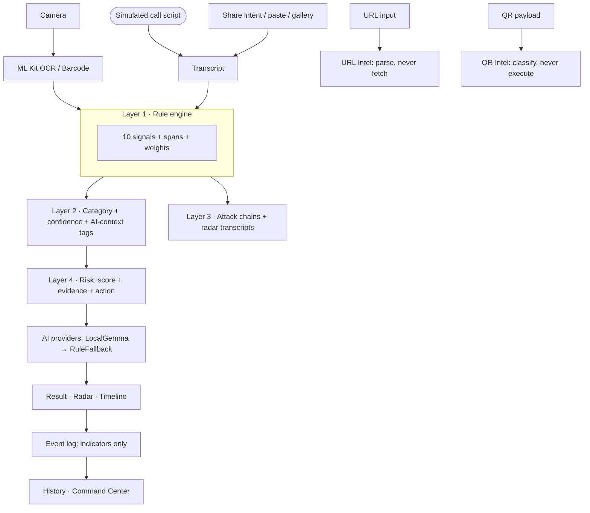

# ScamShield — Your phone's real-time AI fraud firewall

> ScamShield detects suspicious behavior across messages, URLs, QR codes and
> simulated conversations, understands the attack chain, explains the evidence,
> and recommends the safest next action — while keeping analysis local
> whenever supported.

## Problem

India loses thousands of crores yearly to KYC/OTP phishing, lottery lures,
courier fees, task-job fraud and "digital arrest" extortion. Victims are often
non-technical family members who receive one scary message — and obey it.
Cloud blocklists answer too late, explain nothing, and upload your SMS to do it.

## Solution

Detect → Understand → Explain → Intervene → Protect, on the phone itself:

- A **deterministic rule engine owns every verdict** (10 signals, exact spans)
- On-device **Gemma explains** in plain language — or a grounded built-in
  fallback when the model file isn't bundled (verdicts identical either way)
- **Evidence-first UI**: weighted contributions, calibrated confidence,
  category, AI-context tags, and Verify/Block/Report actions

## Why ScamShield

Traditional tools: Message → Analyze → Warn.
ScamShield: **Message / QR / URL / Voice → Understand context → Detect signals
→ Build attack chain → Explain evidence → Warn → Recommend action.**
Most scam tools analyze the message. ScamShield understands the attack.

## Key Features

- Message scan (paste / share / screenshot OCR) with inline highlights
- ScamLens: camera QR (UPI vs link), URL intelligence (parse — don't visit),
  photo → offline OCR
- Scam Radar: simulated scam-call stream with live risk meter + signal popups
- Attack-chain Timeline (KYC bait → link → harvest → OTP → fee)
- Evidence-first results: +weights, heuristic score, confidence, Hindi line
- Family Mode (STOP card + trusted contact), Privacy Center, Command Center,
  Judge Mode, Demo Mode (6 scenarios + chain), dark mode, risk-scaled haptics
- Indicator-only history (digit-masked previews, deletable)

## Architecture



## AI/ML

- `flutter_gemma 0.9.0` (MediaPipe LLM Inference), Gemma 3 1B IT, temp 0.2 /
  topK 1, grounded prompt; sanitizer drops any claim about unfired signals
- `AIProvider` routing: `LocalGemmaProvider` → `RuleFallbackProvider`;
  Judge Mode reports AVAILABLE/UNAVAILABLE + ACTIVE/INACTIVE honestly
- ML Kit on-device text recognition + barcode scanning; no training, no servers
- Stayed on flutter_gemma 0.9.0 (1.8.x exists) for pre-competition stability

## Security

- Scanned URLs are parsed as strings — never visited, resolved, downloaded
- QR payloads classified only, never executed; UPI QRs can only SEND (stated)
- No secrets/keys in code or git; no INTERNET permission; no network imports
- Clipboard sync is explicit user action; imports capped (256 KB / 100 events)
  and schema-validated; camera/gallery via system pickers only

## Privacy

- Full messages and recordings are never stored — events keep indicators +
  digit-masked previews; Radar uses labeled script simulations (no mic)
- Privacy Center discloses processing table + cloud status (not configured)
- Everything deletable; network access: none

## Phone Integration (Phone Features)

Share sheet (text + screenshots), camera QR, photo OCR, haptics scaled to
risk, bottom-nav mobile layout, icon+text+color risk (never color alone),
dark mode, offline-first (airplane-mode demo supported).

## Attack Chain

The hero differentiator. The KYC chain (bait → phishing link → credential
harvest → OTP theft → payment fraud) is analyzed stage-by-stage by the real
engine; every stage becomes a `ThreatEvent` sharing one `chainId`, so the
Timeline, History and Command Center correlate the same genuine chain.
Single bad messages among clean ones are explicitly NOT chains (tested).

## Office Kit

Command Center (in-app; open it on desktop builds) reads the local event log:
live feed with risk filters, event detail sheets, this-device analytics, and
**phone↔desktop sync via clipboard JSON** (Export → Import). No servers, no
accounts, no raw content. LAN auto-sync deliberately deferred
(reliability over flash) — manual JSON fallback is the shipped workflow.
Rehearsed stage workflow: `demo/OFFICE_KIT_DEMO.md`.

## Demo (3 min, airplane mode ON)

Print the QR card first: `demo/QR_CARD.md` (deterministic UPI payload;
projector QRs fail — paper doesn't). In-app Sample QR is the fallback.

1. 0:00 Home — "privacy-first AI fraud firewall", 🔒 Offline
2. 0:15 Demo → Fake KYC → staged **HIGH RISK**
3. 0:35 Evidence: +weights, highlighted spans, AI context
4. 0:55 Lens → URL tab → sample link → **PARSE — DON'T VISIT**
5. 1:15 Lens → QR → sample payment QR → **PAYMENT REQUEST DETECTED**
6. 1:35 Radar → Play → "share your screen" → **REMOTE-ACCESS DETECTED**, risk climbs
7. 1:55 Timeline → 5-stage **MULTI-STAGE SCAM DETECTED**
8. 2:15 Command Center → event arrived live → tap for evidence
9. 2:35 Judge Mode → LOCAL ✓ / NETWORK NONE / FETCHING DISABLED
10. 2:50 Genuine alert → green restraint. *"Most tools analyze the message.
    ScamShield understands the attack."*

## Installation

```powershell
flutter pub get
flutter run            # phone / emulator
flutter run -d chrome  # desktop preview (camera tabs need a phone)
```

Optional on-device explanations: agree to the Gemma terms, download
`gemma-3-1b-it.task` once, copy to `assets/models/`, rebuild. (Gitignored;
never fetched at runtime.)

## Running Tests

```powershell
flutter analyze   # must be clean
flutter test      # 62 tests: signals, breakdown, URL/QR/stages,
                  # category/confidence, providers, Hindi, import guards,
                  # demo verdicts, span exactness, grounding
dart tool/demo_run.dart   # headless pipeline replay
flutter build apk --debug # build/app/outputs/flutter-apk/app-debug.apk
```

## Environment Variables

None. No `.env`, keys, flavors, or remote config.

## Limitations

- Gemma text needs the user-bundled `.task` (large + license-gated); fallback
  explains otherwise — verdicts identical
- URL reputation / domain age / redirects: unavailable offline (labeled)
- Voice is simulated transcripts, not live-call interception (OS restriction)
- Sync is manual clipboard JSON, not automatic wireless
- Camera/OCR quality depends on device ML Kit models; 3 risk tiers (no CRITICAL)

## Future Work

Permission-gated SMS auto-flag, full Hindi UI, LAN auto-sync (kept as fallback
today), domain-lookalike visualizer.
